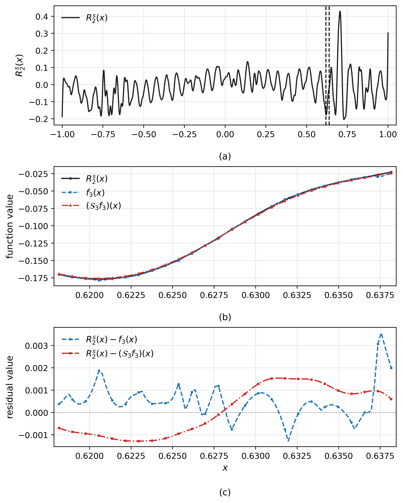
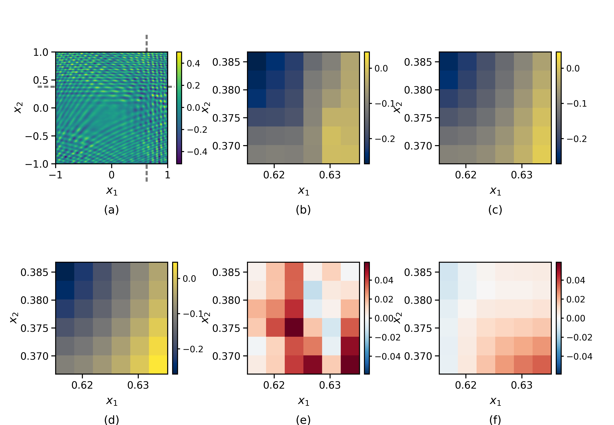

# Multigrade Deep Learning with Smoothing (S-MGDL)

This repository accompanies the paper **"Multigrade Deep Learning with Smoothing"** by Fuliang Lyu, Ronglong Fang, and Yuesheng Xu.

## Illustration of the Smoothing Effect

The following examples illustrate how output smoothing changes the residual passed to the subsequent grade while largely preserving the learned grade output.

### One-Dimensional Example

  

- **(a)** shows the learning target \(R_2^s\) for Grade 3 and the selected local interval.
- **(b)** compares the learning target \(R_2^s\), the learned Grade-3 output \(f_3\), and its smoothed version \(S_3 f_3\) within the selected interval.
- **(c)** compares the residual formed without smoothing, \(R_2^s-f_3\), with the smoothed residual, \(R_2^s-S_3f_3\).

Although \(f_3\) and \(S_3f_3\) are nearly indistinguishable locally, smoothing substantially reduces the rapid oscillations in the residual passed to the next grade.

### Two-Dimensional Example

  

- **(a)** shows the learning target \(R_1^s\) for Grade 2 and the selected local region.
- **(b)** shows the learned Grade-2 output \(f_2\) in the selected region.
- **(c)** shows the smoothed output \(S_2f_2\).
- **(d)** shows the corresponding learning target \(R_1^s\).
- **(e)** shows the residual formed without smoothing, \(R_1^s-f_2\).
- **(f)** shows the smoothed residual, \(R_1^s-S_2f_2\).

The raw and smoothed Grade-2 outputs have very similar local structures, whereas the residual obtained after smoothing has a more coherent local structure.

## Code

The repository contains the numerical experiments presented in the paper.

### Fixed-Grade Function Approximation

The folder `Fixed Grade Function Approximation/` contains the fixed-grade synthetic function approximation experiments:

- Fixed-grade 1D function approximation
- Fixed-grade 2D function approximation
- Fixed-grade 3D function approximation

### Adaptive-Grade Function Approximation

The folder `Adaptive Grade Function Approximation/` contains the adaptive-grade synthetic function approximation experiments:

- Adaptive-grade 1D function approximation
- Adaptive-grade 2D function approximation
- Adaptive-grade 3D function approximation

In these experiments, the multigrade model is trained sequentially, and the number of accepted grades is determined adaptively using the validation error.

### Image Denoising

The folder `Image Denoising/` contains the image-denoising experiments.

The implementation follows a three-stage experimental workflow:

1. **MGDL hyperparameter selection** using validation PSNR.
2. **S-MGDL smoothing-bandwidth selection** using validation PSNR, with the MGDL hyperparameters fixed.
3. **Final evaluation** of MGDL and S-MGDL using the selected parameters.

The three stages are provided separately to keep parameter selection and final evaluation clearly separated and reproducible.
